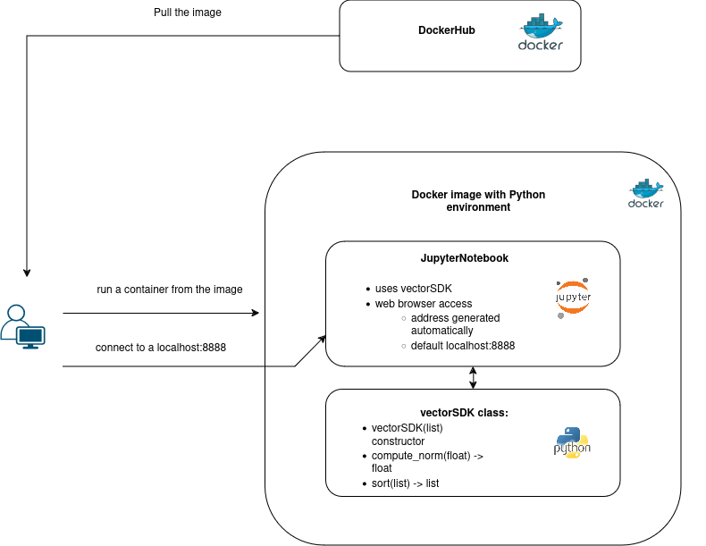

# Architecture


In the following pages I'm going to a discuss modern development workflow based on containerisation with Docker.

As a pedagogigal example we develop a small package `pyvectorSDK` based on numpy.

The package `pyvectorSDK` is installed along with the JupyterNotebook in the DockerImage to simplify the usage. Step by step I show how

- to use containers
- to build your own image
- host it on DockerHub
- automatise testing
- image deployment using GitHub actions with CI/CD approach.




The `pyvectorSDK`package is going to have a simple application interface or API which is shown in the diagram.

```python
vectorSDK(list)  # constructor
.norm(float) -> float  # function computes $l_p$ norm
.sort() -> list  # function arranges the input list 
```


Next\
[page 1. Introduction to Docker](./Docker1.md)