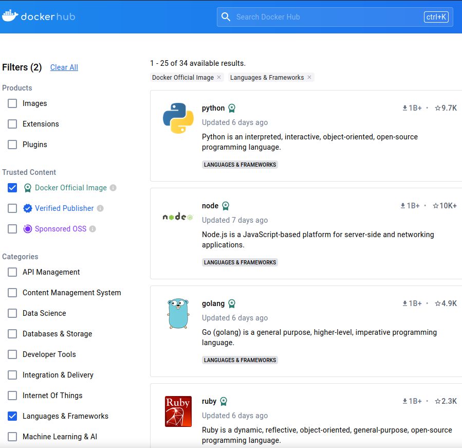

# The main idea of Docker
Software instalation is cumbersome for big projects, especially when it requires additional technical knowledge above `pip install`.
One of the solutions is to pack the installed software version into big "zip" file with all its dependencies, additional configurations and even OS. This "zipping" idea is called docker.

Docker is a tool designed to package software into containers, effectively virtualizing the operating system. Each container acts as an isolated sandbox. Here I'm going to explain docker basics using the notes from Internet.
- [https://www.youtube.com/@TechWorldwithNana/videos](https://www.youtube.com/@TechWorldwithNana/videos)
- [https://docker-curriculum.com/](https://docker-curriculum.com/)
- [https://docs.docker.com/engine/install/ubuntu/#install-using-the-repository](https://docs.docker.com/engine/install/ubuntu/#install-using-the-repository)


# Some terminology
In the next sections you are going to hear about:
  - docker image\
      it is a detailed instruction or blueprint for building a corresponding docker container.
  - docker container\
      "zipped" software, e.g python application, or python as a language, or OS, like Linux

<a href="https://hub.docker.com/search?q=&image_filter=official&categories=Languages%20%26%20Frameworks" target="Docker Hub">
   
</a>

Containers can be stacked on top of each other like LEGO building blocks. First, consider an OS container as the ground floor, Ubuntu for example. Then, a Python container serves as the first floor, and on the top, your Python application acts as the second floor.

The containerisation idea has become so popular that there are plenty of web pages with many already built images for you, like [https://hub.docker.com/](https://hub.docker.com/). In all of these cases there is no need to build everything from the ground, it's already there. A container on the top of the stack knows which container to pull next in this "chain reaction". And if you want to build your own image and container, the good starting point is to use one of these ones from the picture above.

---


Let's go step by step and learn how to use them. In the following pages we are going to discuss
- [Installation](#installation)
- [Using Python in the container](./Docker2.md)
- [Install and use numpy in the python container](./Docker3.md)
- [Build your own container with all the required packages installed](./Docker4.md)

---

<h1 id="installation">Installation</h1>


1. Setting up a docker repo and installing the Docker packages:
```bash
   sudo apt-get update
   sudo apt-get install ca-certificates curl
   sudo install -m 0755 -d /etc/apt/keyrings
   sudo curl -fsSL https://download.docker.com/linux/ubuntu/gpg -o /etc/apt/keyrings/docker.asc
   sudo chmod a+r /etc/apt/keyrings/docker.asc
   echo \
     "deb [arch=$(dpkg --print-architecture) signed-by=/etc/apt/keyrings/docker.asc] https://download.docker.com/linux/ubuntu \
     $(. /etc/os-release && echo "$VERSION_CODENAME") stable" | \
     sudo tee /etc/apt/sources.list.d/docker.list > /dev/null
   sudo apt-get update
   sudo apt-get install docker-ce docker-ce-cli containerd.io docker-buildx-plugin docker-compose-plugin
```
1. Verify that the Docker Engine installation is successful by running the hello-world image
```bash
sudo docker run hello-world
```

After the first run on my machine I got the following

>Unable to find image 'hello-world:latest' locally
>latest: Pulling from library/hello-world
>c1ec31eb5944: Pull complete 
>Digest: sha256:1b5a981c857d64321e97cbadf20b183e3c2814ee68315f42011e057d2ac467e9 
>Status: Downloaded newer image for hello-world:latest
>
>Hello from Docker!
>This message shows that your installation appears to be working correctly.
>
>To generate this message, Docker took the following steps:
> 1. The Docker client contacted the Docker daemon.
> 2. The Docker daemon pulled the "hello-world" image from the Docker Hub.
>    (amd64)
> 3. The Docker daemon created a new container from that image which runs the
>    executable that produces the output you are currently reading.
> 4. The Docker daemon streamed that output to the Docker client, which sent it
>    to your terminal.
>
>To try something more ambitious, you can run an Ubuntu container with:
> $ docker run -it ubuntu bash
>Share images, automate workflows, and more with a free Docker ID:
> https://hub.docker.com/
>For more examples and ideas, visit:
> https://docs.docker.com/get-started/


Congratulations, docker is installed on your machine.

Execution command might not simply run without `sudo`
```bash
docker ps  # Process Status lists all the containers 
```
gives the error

>permission denied while trying to connect to the Docker daemon socket at unix:///var/run/docker.sock: Get "http://%2Fvar%2Frun%2Fdocker.sock/v1.45/containers/json": dial unix /var/run/docker.sock: connect: permission denied

The problem can be solved with creating a group with permission rights.
```
sudo usermod -aG docker YOUR_USERNAME # username can be found with `whoami` command
newgrp docker
```
now the command should work
```bash
docker ps
```


[Docker page 2. Using Python in the container](./Docker2.md)