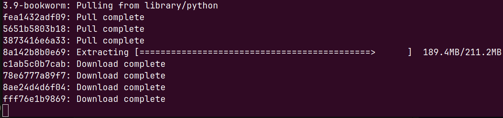

# Your first [Python container](https://hub.docker.com/_/python)

After following the link, you will find many different versions of Python, such as 3.12, 3.9, etc. Which one should you choose? Additionally, terms like 'Alpine,' 'Bookworm,' and 'Bullseye' refer to different versions of Linux. Alpine is considered extremely lightweight, while Bookworm and Bullseye are versions of Debian (cousin of Ubuntu)." I randomly select "bookworm" python 3.9.19 and click on the [link](https://github.com/docker-library/python/blob/1b7a1106674a21e699b155cbd53bf39387284cca/3.9/bookworm/Dockerfile), which brings me to the *Dockerfile*. 

## Dockerfile
A Dockerfile is a text file that contains instructions on how Docker should build a container. Here's what typically goes inside it:

- `FROM`: This directive specifies the base image to use for the Docker container. For example, we use buildpack-deps:bookworm as our starting point.
- `RUN`: This command executes during the building phase of the container. With RUN, you can install packages, copy files from your computer to the container, or perform other setup tasks.
- `ENV`: This sets environment variables within the container, similar to how the env command works in Linux. It can define things like the location of Python, your username, and more.
- `CMD`: This specifies the command that runs when the container starts. It acts as the **default** entry point of the container. In our example, the container starts with CMD ["python3"]. The syntax CMD ["executable", "parameter1", "parameter2", ...] mirrors how you would run a command in a terminal, such as python3 myscript.py -i inputfile.txt.

These elements together define how the Docker container is built and what it does when it runs.

## Pull Python image from DockerHub
The actual term for "install" is `pull`. As mentioned above, I randomly select python continer "bookworm 3.9". Let's pull the python docker image with a name specification to the computer. During the execution
```bash
docker pull python:3.9-bookworm  # semicolon : allows to specify version tag
```
you will see

The resulting image can be found in the docker images
```bash
docker images  # list all images stored in the computer
```

```
REPOSITORY   TAG                  IMAGE ID       CREATED        SIZE
python       3.10.14-alpine3.20   f484900e23bd   8 days ago     55.7MB
python       3.9-bookworm         9dcab61c255c   3 months ago   997MB
```
You see `3.10.14-alpine3.20` because I tried to pull other version as well. To delete it run
```bash
#docker rmi IMAGE_ID # rm remove, i image
docker rmi f484900e23bd  # image_id is  f484900e23bd
```

## Run the container
Docker creates a container from image and from the same image one can create many containers. To see available docker images on the computer, run
```
docker images
```
which outputs 
```
REPOSITORY   TAG                  IMAGE ID       CREATED        SIZE
python       3.9-bookworm         9dcab61c255c   3 months ago   997MB
```
We want to run this python repositpry. It can be done in 2 similar ways -- with image ID or with repository name + tag
```bash
docker run python:3.9-bookworm
# OR equivalently
# docker run 9dcab61c255c
```
Executing `docker run python:3.9-bookworm` did nothing. But why?
Docker opened python successfully, didn't see anything to execute and exited. But we want to have an access to the python interactive terminal. 
```bash
docker run -it python:3.9-bookworm  # -it is interactive terminal
```
gives the desired result. Great ! How to install now `numpy` ? Usually we do that with terminal, not from python REPL interpreter. 

As we discussed above, the `CMD ["python3"]` in Dockerfile configurations defines a default entrypoint which is `python3`. But we can change it easily.

```bash
docker run -it python:3.9-bookworm bash 
# OR
# docker run -it python:3.9-bookworm /bin/bash
# OR
# docker run -it python:3.9-bookworm /bin/sh  # for shell if usual bash is not installed 
```

Now let's install `numpy` and run some calculations
[Installing numpy](./Docker3.md) 