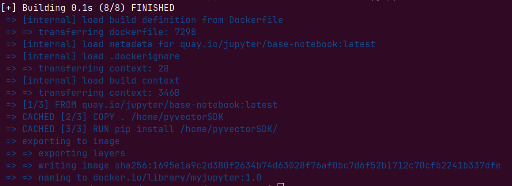
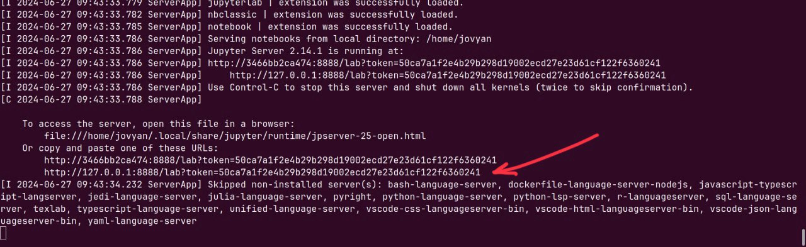
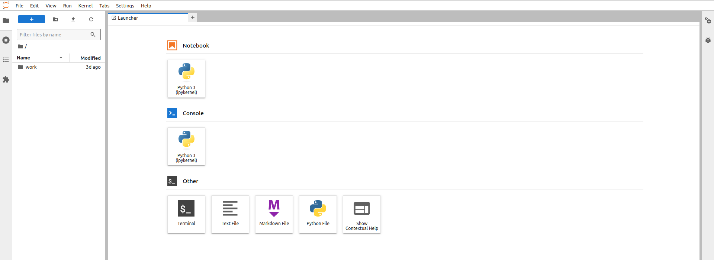

# SDK and Jupyter notebook

Let generalise the example to $l_p$ norm $||x||_p = (\sum_i |x_i|^p)^{1/p}$ and convert the script `norm.py` to a meaningful small package prototype. Later we will generalise it into a package.

```
vectorSDK/
├── vectorSDK/
│   ├── __init__.py
│   ├── lnorm.py
│   └── sdk.py
├── tests/
│   ├── __init__.py
│   ├── test_lnorm.py
│   └── test_sdk.py
├── setup.py
├── Dockerfile
```
with the following files.
```python
# lnorm.py
import numpy as np

def compute_l_p_norm(vector, p):
    if p <= 0:
        raise ValueError("p must be a positive number.")
    
    l_p_norm = np.sum(np.abs(vector) ** p) ** (1 / p)
    return float(l_p_norm)  # to avoid np.float type

def sort(vector):
    return np.sort(vector)
```

In the `sdk.py` we *encapsulate* all the detail of the code. It enables easy integration of the algorithm to other projects.

As an example, I'll mention a car. The steering wheel, gas pedal, and brake pedal are the interface. You as a user don't need to know how engine or gear work. You have only 3 options : turn, accelerate and stop.

Using the car analogy: the Python code might have dependencies, some internal logic, parameters etc. The Python code is a car. The user who wants to interact with the code should do it through the following interfaces

```python
# sdk.py
from .lnorm import compute_l_p_norm, sort

class vectorSDK:
    def __init__(self, vector):
        self.vector = vector

    def compute_norm(self, p):
        return compute_l_p_norm(self.vector, p)

    def sort(self):
        return sort(self.vector)
```

and the `__init__.py` contains what classes and functions will be exported
```python
# __init__.py
from .sdk import vectorSDK

# Now users can do:
# from pyvectorSDK import vectorSDK
```

The setup file contains
```python
# setup.py
from setuptools import setup, find_packages

setup(
    name='vectorSDK',
    version='0.1.0',
    packages=find_packages(),
    install_requires=[
        'numpy'  # our package uses Numpy, here you can include other packages
    ],
)
```
And the tests\
`tests/test_lnorm.py` :
```python
# tests/test_lnorm.py
from vectorSDK.lnorm import compute_l_p_norm, sort
import numpy as np

def test_compute_l_p_norm():
    vec = np.array([3, 4])
    assert (compute_l_p_norm(vec, 2) == 5), "L2 norm calculation is incorrect"

def test_compute_l_p_norm_raises():
    vec = np.array([3, 4])
    with pytest.raises(ValueError, match="p must be a positive number"):
        compute_l_p_norm(vec, -1)

def test_sort():
    vec = np.array([3, 1, 2])
    assert np.array_equal(sort(vec), np.array([1, 2, 3])), "Vector sorting failed"
```
`tests/test_sdk.py` :
```python
# tests/test_sdk.py
from vectorSDK.sdk import vectorSDK

def test_compute_norm():
    vec = vectorSDK([3, 4])
    assert vec.compute_norm(2) == 5, "Norm computation incorrect"

def test_sort():
    vec = vectorSDK([3, 2, 1])
    assert vec.sort().tolist() == [1, 2, 3], "Vector sorting incorrect"
```

## Integrating our package with Jupyter notebook
Now we can build a Jupyter notebook container and put inside our improvised package.
Docker file for Jupyter notebook is fully based on the previous [example](./Docker4.md).

```Dockerfile
# Dockerfile

# Jupyter images recently moved from DockerHub server to RedHat 'quay'
# we reflect that in the address. Image is pulled from the webpage 'quay.io'
FROM quay.io/jupyter/base-notebook 

# change user to ROOT to get installation permission on the image
USER root
# Copy our vectorSDK package
# Dont forget that dockerfile should be in the same folder as our package
COPY . /home/pyvectorSDK

# we don't need to create venv. Docker image designers did it for us
# just go with pip install 
RUN pip install /home/vectorSDK

# Switch back to the default user (jovyan is author of Jupyter images)
USER $NB_USER

# this is important part. Jupyter notebooks are used with web browsers
# a web browser will connect to jupyter with this port, default if 8888
EXPOSE 8888

# Run Jupyter Notebook
CMD ["start-notebook.sh"]
```

everything is ready ! Now we build an image. Go to the folder where the Dockerfile is. Attention, it should be in the same place as the package.
```
vectorSDK/
├── vectorSDK/
├── tests/
├── setup.py
├── Dockerfile
```
run 
```bash
docker build -t myjupyter:1.0 . 
```
where `-t` means `tag`. I decided to give a name `myjupyter` and a version tag `1.0`. The dot symbol `.` is crutial at the end of the command. It tells where to find a Dockerfile and `.` means "here". The command results to


Now run the image
```bash
docker run --rm -p 8888:8888 myjupyter:1.0
```
what is `-p 8888:8888`? Jupyter notebooks usually are designed as a webpages that you can run on your local computer. The address of that webpage is `8888` by default, which is reflected in the second part `:8888` and also in the dockerfile `EXPOSE 8888`. The container says "if you want to use me as a web server, I'm accessible with the address `8888`". The first part of `8888:` is saying which address of our computer we use to connect to the `myjupyter:1.0` container. All together it read "port connect_with:connect_to" `-p 8888:8888`. It's not necessary to use `8888:` it might be occupied by other service. So you can change it to any other number. I personally change it to `8889:` or `10000:`.

After executing the command above you should get


Click on the line, or copy-paste it to the browser. And voila


