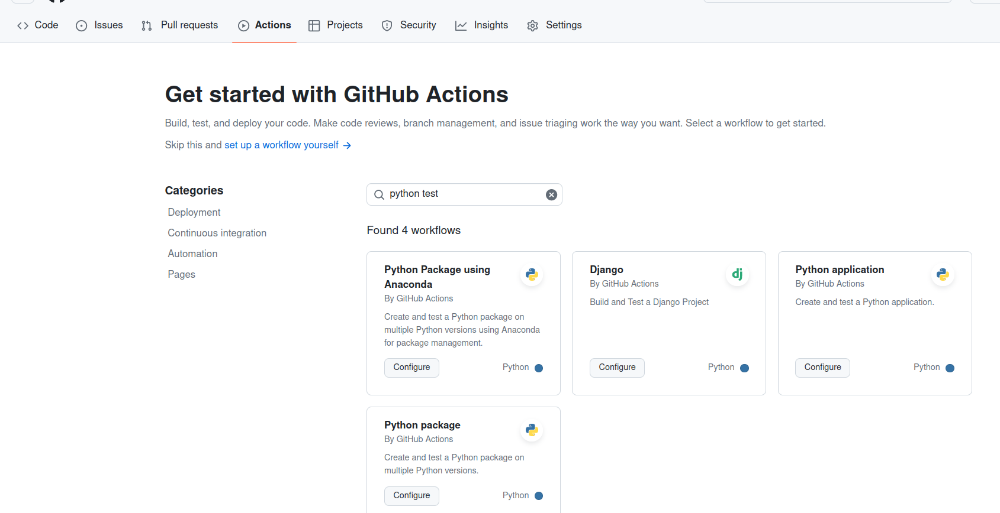

# DockerHub

Results of our work can be saved and shipped to our friends or colleagues ! Dockerhub allows you to save your docker image on the web page [docker.io](docker.io). Containerisation and the docker approach are so popular that there are plenty of different container registies, moreover, you can create your own with AWS, Google and similar services.

To store your docker image on DockerHub, go to the web page [https://hub.docker.com/](https://hub.docker.com/) and signup.

Then click on the "Create repository", chose a name, give a description and click on "Create". Let's make the repo public


To push our fresh previously created image, one has to login on the system. Where to get credentials?

Click on your profile icon > edit your profile > security > New access token. Give a name your prefer and press "Generate" button. 

Now open the terminal and follow the instructions from "Generate".
copy the line `docker login` and paste it to the terminal. It should ask for the password. Paste it here. You will see a message "Login Succeeded".

Now we can push the image to dockerhub.
```bash
# use your username on dockerhub, because the image
# there will be assocoiated with the webpage address.
# To do that renames a tag according to docker requirements
docker tag myjupyter:1.0 YOURUSERNAME/pyvectorsdk:1.0 #this renames a tag 
docker push YOURUSERNAME/pyvectorsdk:1.0
```

The jupyter image with sdk package now is in your repo. 


# CI / CD on GitHub
Our software package and SDK can become complex. For example, after modifying a function, it might return a tuple of numbers instead of a single number. Mistakes can also be introduced accidentally. Automated tests are designed to catch these bugs and ensure the software performs as expected.

Let’s implement automatic verification and testing for our package.

GitHub Actions provide a predefined set of popular tool combinations. Whether you want to welcome newcomers, respond to pull requests, check code formatting, or assign issues to other contributors, these tasks can be automated with GitHub Actions.
GitHub has a [marketplace](https://github.com/marketplace?type=actions) with many solutions, besides the standard offered ones.

## CI - continuous integration
CI workflow assumes that any new smll change goes directly to the main branch, thats why it's called that. Continuous means changes are small, integration means that you put them into the code base and don't break logic of your code. Is the code still valid and meaningful ? Validation can be assigned to a computer, though automatised.

Let's go to the GitHub repository page and select the 'Actions' tab.
I'm chosing simplest one "Python application" that will allow us to test our `pyvectorSDK`. Click "Configure"


GitHub will create a `python-app.yaml`

```yaml
# python-app.yaml
# This workflow will install Python dependencies, run tests and lint with a single version of Python
# For more information see: https://docs.github.com/en/actions/automating-builds-and-tests/building-and-testing-python

# you can chose a name for the action, not mandatory
name: Python application

on:
  push:
    branches: [ "main" ]
  pull_request:
    branches: [ "main" ]

permissions:
  contents: read

jobs:
  build:

    runs-on: ubuntu-latest

    steps:
    - uses: actions/checkout@v4
    - name: Set up Python 3.10
      uses: actions/setup-python@v3
      with:
        python-version: "3.10"
    - name: Install dependencies
      run: |
        python -m pip install --upgrade pip
        pip install flake8 pytest
        if [ -f requirements.txt ]; then pip install -r requirements.txt; fi
    - name: Lint with flake8
      run: |
        # stop the build if there are Python syntax errors or undefined names
        flake8 . --count --select=E9,F63,F7,F82 --show-source --statistics
        # exit-zero treats all errors as warnings. The GitHub editor is 127 chars wide
        flake8 . --count --exit-zero --max-complexity=10 --max-line-length=127 --statistics
    - name: Test with pytest
      run: |
        pytest
```

Press "Commit changes". Now you have fully tested package. This workflow triggers your own written tests in the python package folder `pyvectorSDK/test`. It doesn't write tests for you.

## CD - continuous delivery or deployment

Lets add the next step. Every new change that is introduced, can be pushed to the dockerhub. This part is called deployment. It's so popular that people already took care and automatised this part as well.
Go to the [GitHub marketplace](https://github.com/marketplace) and find [Build and push Docker images](https://github.com/marketplace/actions/build-and-push-docker-images#usage).

It's suggest to integrate this file to our github workflow. We can modify our previous `python-app.yaml` or add a new workflow. The first option is well described in [youtube video CI/CD with github actions](https://www.youtube.com/watch?v=R8_veQiYBjI).
We go with second way and create our own new workflow. Go to the webpage of the github repo and chose "actions" as we did before. Click on "setup a workflow yourself" and copy paste this solution [Build and push Docker images](https://github.com/marketplace/actions/build-and-push-docker-images#usage).

```yaml
name: ci

on:
  push:
    branches:
      - 'main'

jobs:
  docker:
    runs-on: ubuntu-latest
    steps:
      -
        name: Set up QEMU
        uses: docker/setup-qemu-action@v3
      -
        name: Set up Docker Buildx
        uses: docker/setup-buildx-action@v3
      -
        name: Login to Docker Hub
        uses: docker/login-action@v3
        with:
          username: ${{ secrets.DOCKERHUB_USERNAME }}
          password: ${{ secrets.DOCKERHUB_TOKEN }}
      -
        name: Build and push
        uses: docker/build-push-action@v6
        with:
          push: true
          tags: docker pull kemalbidzhiev/pyvectorsdk:1.0
```

Pay attention on the last parts. In the `tags` part we replaced  `user/app:latest` by address of the Docker hub repo `kemalbidzhiev/pyvectorsdk:1.0`.
What are `secrets` ? Github allows you to syncronize the development tools. Dockerhub can generate a username and a key for you and GitHub will use it to automatically login and push the image. 


Open "Settings" in a new tab, on the left hand side find "Secrets and variables", chose actions and press "new repository secter"