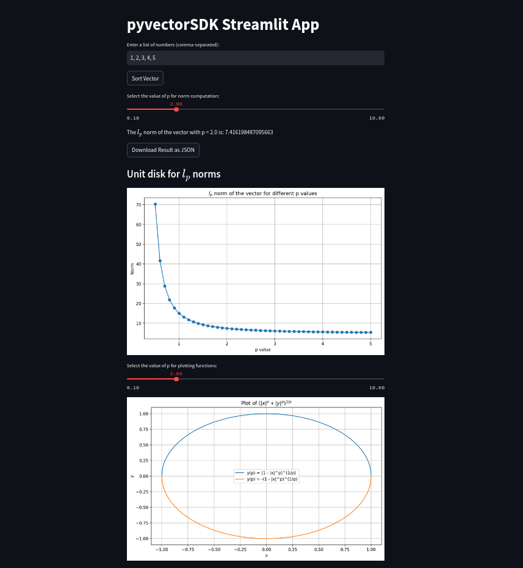

# Streamlit
Streamlit is a popular JupyterNotebook type data science tool. It allows an easy deploy a webpage with python packages functionality.

First of all installation is straight forward.
```bash
pip install streamlit
streamlit hello
```
If you terminal doesn't respond to `python` but reacts to `python3` command, streamlit can be called with `python3 -m streamlit hello`. I suggest to install `apt install python-is-python3` to avoid confusions with `pip3` and with `python3`


To demonstrate how easy it's to make a webpage with streamlit, create a python file
```python
# main.py
import streamlit as st

st.title('pyvectorSDK Streamlit App')
```
Streamlit page is ready! now you can run it with
```bash
streamlit run main.py
```

## Using pyvectorSDK

Streamlit allows an easy incorporation of the different buttons and sliders with existing python pakcages. For instance, user input can be read as easy as

```python
# Input: Accepting a list of numbers from the user
user_input = st.text_input('Enter a list of numbers (comma-separated):', '1, 2, 3, 4, 5')
```

Now we can create a `vectorSDK` object
```python
# main.py
import streamlit as st
from pyvectorSDK import vectorSDK

st.title('pyvectorSDK Streamlit App')

user_input = st.text_input('Enter a list of numbers (comma-separated):', '1, 2, 3, 4, 5')

# Convert the input string to a list of floats
try:
    vector = vectorSDK([float(i) for i in user_input.split(',')])
except ValueError:
    st.error('Please enter a valid list of numbers.')
    st.stop()
```

Simple functions, like `vectorSDK.sort()` can be presented as a web page buttons
```python
# Button to sort the vector
if st.button('Sort Vector'):
    sorted_vector = vector.sort()
    st.write(f'The sorted vector is: {sorted_vector}')
```

## Sliders and parameters
You can find all of the wigdets on the official [web page](https://docs.streamlit.io/develop/api-reference/widgets/st.slider).
As an example we use a slider. $l_p$ norm of a vector can be presented as a function of $p$ and dynamically be updated.

```python
p_value = st.slider('Select the value of p for norm computation:', min_value=0.1, max_value=10.0, value=2.0, step=0.1)

norm = vector.compute_norm(p_value)
st.write(f'The $l_p$ norm of the vector with p = {p_value} is: {norm}')
```
We chose a minimal and maximal values to avoid under/overflow.

The computed result can be downloaded 
```python
import json
# Prepare the result as a dictionary
result = {
    'vector': [float(i) for i in user_input.split(',')],
    'p': p_value,
    'norm': norm
}
result_json = json.dumps(result) # Convert the result to a JSON string

# Add a download button
st.download_button(
    label="Download Result as JSON",
    data=result_json,
    file_name='result.json',
    mime='application/json'
)
```

And of course, you can plot data

```python
p_values = [i / 10.0 for i in range(5, 41)]
norm_values = [vector.compute_norm(p) for p in p_values]

plt.figure(figsize=(10, 6))
plt.plot(p_values, norm_values, marker='o')
plt.xlabel('p value')
plt.ylabel('Norm')
plt.title('Norm of the vector for different p values')
plt.grid(True)

st.pyplot(plt)
```


The entire script is
```python
import streamlit as st
from pyvectorSDK import vectorSDK
import matplotlib.pyplot as plt
import json


# Set the title of the app
st.title('pyvectorSDK Streamlit App')

# Input: Accepting a list of numbers from the user
user_input = st.text_input('Enter a list of numbers (comma-separated):', '1, 2, 3, 4, 5')

# Convert the input string to a list of floats
try:
    vector = vectorSDK([float(i) for i in user_input.split(',')])
except ValueError:
    st.error('Please enter a valid list of numbers.')
    st.stop()

# Button to sort the vector
if st.button('Sort Vector'):
    sorted_vector = vector.sort()
    st.write(f'The sorted vector is: {sorted_vector}')

# Input: Slider to accept a value for p from the user
p_value = st.slider('Select the value of p for norm computation:', min_value=0.1, max_value=10.0, value=2.0, step=0.1)

# Compute and display norm automatically when the slider is manipulated
norm = vector.compute_norm(p_value)
st.write(f'The $l_p$ norm of the vector with p = {p_value} is: {norm}')

# Prepare the result as a dictionary
result = {
    'vector': [float(i) for i in user_input.split(',')],
    'p': p_value,
    'norm': norm
}
result_json = json.dumps(result) # Convert the result to a JSON string

# Add a download button
st.download_button(
    label="Download Result as JSON",
    data=result_json,
    file_name='result.json',
    mime='application/json'
)

# Plotting x = p values, y = norms
p_values = [i / 10.0 for i in range(5, 41)]  # Generate p values from 0.1 to 10.0
norm_values = [vector.compute_norm(p) for p in p_values]  # Compute corresponding norms

# Create the plot
plt.figure(figsize=(10, 6))
plt.plot(p_values, norm_values, marker='o')
plt.xlabel('p value')
plt.ylabel('Norm')
plt.title('$l_p $orm of the vector for different p values')
plt.grid(True)

# Display the plot
st.pyplot(plt)
```

Just for fun I want to demonstrate how unit disk behaves under different p for $l_p$ norm
```python
st.subheader('Unit disk for $l_p$ norms')
# Plotting x = p values, y = norms for different p values
p_values = [i / 10.0 for i in range(5, 51)]  # Generate p values from 0.5 to 10.0
norm_values = [vector.compute_norm(p) for p in p_values]  # Compute corresponding norms

# Create the plot for norms
plt.figure(figsize=(10, 6))
plt.plot(p_values, norm_values, marker='o')
plt.xlabel('p value')
plt.ylabel('Norm')
plt.title('$l_p$ norm of the vector for different p values')
plt.grid(True)
st.pyplot(plt)


# Slider to select the value of p for plotting functions
p_value_plot = st.slider('Select the value of p for plotting functions:', min_value=0.1, max_value=10.0, value=2.0, step=0.1)
x_values = np.linspace(-1, 1, 400)  # Generate x values from -1 to 1
y1_values = [(1 - abs(x)**p_value_plot)**(1/p_value_plot) if abs(x)**p_value_plot <= 1 else 0 for x in x_values]
y2_values = [-(1 - abs(x)**p_value_plot)**(1/p_value_plot) if abs(x)**p_value_plot <= 1 else 0 for x in x_values]

# Create the plot for y(p) functions
plt.figure(figsize=(10, 6))
plt.plot(x_values, y1_values, label='y(p) = (1 - |x|^p)^(1/p)')
plt.plot(x_values, y2_values, label='y(p) = -(1 - |x|^p)^(1/p)')
plt.xlabel('x')
plt.ylabel('y')
plt.title('Plot of y(p) = (1 - |x|^p)^(1/p) and y(p) = -(1 - |x|^p)^(1/p)')
plt.legend()
plt.grid(True)

# Display the plot
st.pyplot(plt)
```

The main page will have a following form
