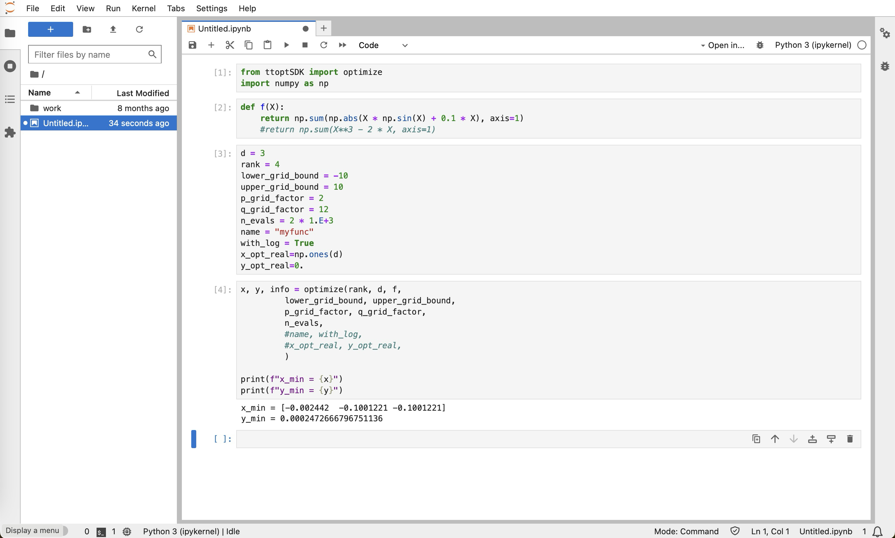

# Designing an SDK for TTopt

Lets first design a small Python package of the following structure
```
ttoptSDK/
├── ttoptSDK/
│   ├── __init__.py
│   └── sdk.py
├── tests/
│   ├── __init__.py
│   └── test_sdk.py
├── requirements.txt
└── setup.py
```

I put the actual code in the `sdk.py`. In the file `test_sdk.py` I write a set of tests to check the code in the `sdk.py`.


In the `setup.py` we put minimal required info:
```python
# setup.py
from setuptools import setup, find_packages

setup(
    name='ttoptSDK',
    version='0.1',
    packages=find_packages(),
    install_requires=[
        "ttopt==0.6.2",
    ],
    setup_requires=['pytest-runner'],
    tests_require=['pytest']
)
```
Setup file can be accompanied with `requirements.txt` where python package contains list of dependentcies. Depending on the platform this file might be used.
```python
# requirements.txt
ttopt==0.6.2
```

### The main code skd.py

In the main file `sdk.py` I gather all the parameters of chosen example [qtt_100d](https://github.com/AndreiChertkov/ttopt/blob/master/demo/qtt_100d.py).
This design allows to external user chose an input function, its dimension and parametrise search with chosing an approximation rank `r`, number of lattice points `n=p^q`, number of samples etc.

```python
# sdk.py
from ttopt import TTOpt

def optimize(
    rank, d, f,
    lower_grid_bound, upper_grid_bound,
    p_grid_factor, q_grid_factor, n_evals,
    name='Alpine', with_log=False,
    x_opt_real=None, y_opt_real=None,
    ):

    tto = TTOpt(
    f=f, d=d,
    a=lower_grid_bound, b=upper_grid_bound,
    p=p_grid_factor, q=q_grid_factor, evals=n_evals,
    x_opt_real=x_opt_real, y_opt_real=y_opt_real,
    name=name, with_log=with_log)

    tto.optimize(rank)

    assert tto.k_evals == n_evals

    x_min, y_min = tto.x_opt, tto.y_opt
    n_chache_usage = tto.k_cache
    t_average = tto.t_evals_mean
    total = tto.info()

    return x_min, y_min, (n_chache_usage, t_average, total)
```

In the tecknical file `__init__.py` we can put information which function to export or make visible for other packages.
```python
# __init__.py
from .sdk import optimize
```

The file with `test_sdk.py` can be organized, for example, as in [here](https://github.com/kbidzhiev/TToptSDK/blob/main/tests/test_sdk.py).


# CI/CD for the package
## CI part
Next steps in the articles will continue and use part of["Docker from zero to hero"](../Docker/Docker1.md).

The developed `ttoptSDK` package can be integrated to the framework of automatic benchmarking, called "Continuous integration/Continuous development".
GitHub simplified all the step, such that the most common and popular solutions are collected in Github actions. 
I go to the GitHub repo of my project and in a tab "actions" I chose "Python Package" and click "Configure"
.
GitHub suggests a `.yml` file which instructs github remote computers-servers with steps to install and syncronize with `ttoptSDK` that we developed. Click "commit" and `TToptSDK/.github
/workflows/python-app.yml` will be added to the project.
`requirements.txt` is used in the GitHub action, so be sure to create the file in the root folder of the `ttoptSDK` repo.


Now the automatic testing is implemented in the repo. This happened because of the test files in [ttoptSDK/tests/](https://github.com/kbidzhiev/TToptSDK/tree/main/tests)


## CD part
Continuos deployment assumes usually that the last version of the product is deployed and works. As a working solution we share a docker image, that scientist can install and use.

### Docker
Docker system allows to containerize the SDK solution that we developed into a portable docker image. To do so, one should write a set of instructions, called "Dockerfile".

```Dockerfile
# Dockerfile
FROM python:3.12-bookworm

RUN mkdir -p /ttoptSDK
WORKDIR /ttoptSDK
COPY . .
COPY ./examples/python/example1.py /home/
COPY ./examples/python/example2.py /home/

ENV VIRTUAL_ENV=/ttoptSDK/
RUN python3 -m venv $VIRTUAL_ENV
ENV PATH="$VIRTUAL_ENV/bin:$PATH"

WORKDIR /ttoptSDK
RUN pip install -e .

# Set the working directory in the container
WORKDIR /home/
# Run the application:
CMD ["/bin/bash"]
```


Besides that I create a `Dockerfile` for jupyter notebooks to demonstrate that the application well integrates with other workflows.

```Dockerfile
# Dockerfile.jupyter
FROM jupyter/base-notebook

USER root
COPY . /ttoptSDK
RUN pip install /ttoptSDK
# Switch back to the default user (jovyan is author of Jupyter images)
USER $NB_USER
EXPOSE 8888
CMD ["start-notebook.sh"]
```

when building the image, don't forget specify the connection port, see an [example](https://kbidzhiev.github.io/Docker/Docker5.html).
```bash
docker run --rm -p 8888:8888 jupytersdk:1.0
```
Example of usage :



### Pushing to Dockerhub
the last step for implementing continuous deployment is to push the developed image to Dockerhub.
Dockerhub suggests to rename the local image, such that it will fit your dockerhub account address and then push it to the server.
```bash
docker tag ttoptsdk:1.0 kemalbidzhiev/ttoptsdk:1.0 
docker push kemalbidzhiev/ttoptsdk:1.0
```
It might take some time.


[Page 3. Basic web interface](./ttopt2.md)